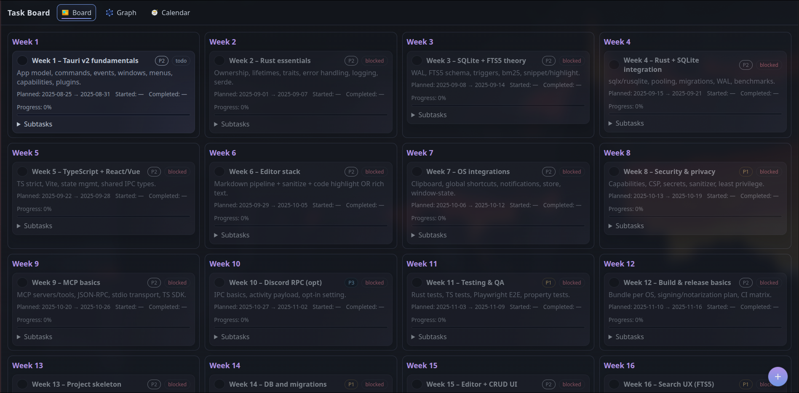

# Task Board: A Modern Project Planner

This is a minimalist, modern, and highly interactive project planning application built with Flask and a vanilla JavaScript frontend. It provides a Kanban-style board, a dependency graph, and a calendar view to manage complex projects with prerequisites.



## Features

- **Multiple Views:**
  - **Board:** A Kanban-style view organizing tasks by week.
  - **Graph:** An interactive force-directed graph visualizing task dependencies.
  - **Calendar:** A full-featured monthly calendar displaying task durations.
- **Task Management:**
  - Create, edit, and delete tasks and subtasks.
  - Track progress with status labels (`todo`, `in_progress`, `done`, `blocked`).
  - Set task priorities (High, Normal, Low).
- **Dependency Logic:**
  - Define prerequisites for tasks.
  - Tasks are automatically **blocked** if their dependencies are not complete.
  - Completing a task automatically **unblocks** its dependents.
- **Modern UI/UX:**
  - Sleek, dark, "amorphous" theme with subtle animations.
  - Responsive top navigation bar with icons.
  - Advanced task creation modal with a searchable dependency selector.
  - Client-side logic to enforce valid week assignments based on dependencies.

## How It Works: Core Concepts

The application's logic revolves around a few key principles:

1.  **Status Automation:** A task's status is often derived from its state.
    - Ticking the first subtask moves a `todo` task to `in_progress` and records the `started_at` date.
    - Completing the last subtask moves a task to `done` (if not blocked) and records the `completed_at` date.
    - Adding a new subtask to a `done` task reverts it to `in_progress`.
2.  **Dependency Blocking:** This is the most critical feature.
    - A task cannot be marked `done` if any of its prerequisites are not `done`.
    - If a task's dependencies are incomplete, its status is automatically set to `blocked`.
    - When a task is completed, the application re-evaluates all tasks that depend on it and unblocks them if all other prerequisites are met.
3.  **Data Persistence:** All data is stored in a local `tasks.db` SQLite file, making the application self-contained and portable.

## Getting Started

### Prerequisites

- **Python 3.11+**
- **uv:** An extremely fast Python package installer and resolver. If you don't have it, install it:
  ```bash
  pip install uv
  ```

### Installation & Setup

1.  **Clone the repository:**

    ```bash
    git clone <your-repo-url>
    cd tasks
    ```

2.  **Install dependencies:** `uv` will read the `pyproject.toml` and create a virtual environment (`.venv`) with the required packages.

    ```bash
    uv sync
    ```

3.  **Initialize the Database:** This creates the `tasks.db` file and runs the necessary table setup.

    ```bash
    uv run -- flask --app main:app db-init
    ```

4.  **Seed with Sample Data (Optional but Recommended):** This populates the board with the 24-week project plan defined in `seeds/tasks_seed.json`.

    ```bash
    uv run -- flask --app main:app db-seed
    ```

5.  **Run the Application:**
    ```bash
    uv run -- flask --app main:app run -p 5000
    ```
    The application will be available at `http://127.0.0.1:5000`.

## Database Schema

The application uses three main tables in the `tasks.db` SQLite database.

### `task` Table

This is the central table for all tasks.

| Column         | Type       | Description                                                        |
| :------------- | :--------- | :----------------------------------------------------------------- |
| `id`           | `INTEGER`  | **Primary Key.** Unique identifier for the task.                   |
| `slug`         | `TEXT`     | A URL-friendly version of the title.                               |
| `title`        | `TEXT`     | The main title of the task.                                        |
| `description`  | `TEXT`     | A longer description of the task.                                  |
| `status`       | `TEXT`     | The current state: `todo`, `in_progress`, `done`, or `blocked`.    |
| `priority`     | `INTEGER`  | Priority level: `1` (High), `2` (Normal), `3` (Low).               |
| `week`         | `INTEGER`  | The planned week number for the task.                              |
| `start_date`   | `DATE`     | The planned start date (calculated from `week`).                   |
| `end_date`     | `DATE`     | The planned end date (calculated from `week`).                     |
| `started_at`   | `DATE`     | The actual date the task was moved to `in_progress`. **Nullable.** |
| `completed_at` | `DATE`     | The actual date the task was moved to `done`. **Nullable.**        |
| `progress`     | `REAL`     | A percentage (0.0 to 100.0) calculated from subtask completion.    |
| `created_at`   | `DATETIME` | Timestamp of when the task was created.                            |
| `updated_at`   | `DATETIME` | Timestamp of the last update to the task.                          |

### `subtask` Table

Stores the checklist items for a parent task.

| Column    | Type      | Description                                             |
| :-------- | :-------- | :------------------------------------------------------ |
| `id`      | `INTEGER` | **Primary Key.** Unique identifier for the subtask.     |
| `task_id` | `INTEGER` | **Foreign Key** to `task.id`. Links to the parent task. |
| `title`   | `TEXT`    | The description of the subtask item.                    |
| `done`    | `BOOLEAN` | `true` if the subtask is completed, otherwise `false`.  |

### `dependency` Table

Represents the prerequisite relationships (a directed graph edge).

| Column          | Type      | Description                                                          |
| :-------------- | :-------- | :------------------------------------------------------------------- |
| `id`            | `INTEGER` | **Primary Key.**                                                     |
| `task_id`       | `INTEGER` | **Foreign Key** to `task.id`. The task that has a prerequisite.      |
| `depends_on_id` | `INTEGER` | **Foreign Key** to `task.id`. The task that must be completed first. |

## Seeding Data: The `tasks_seed.json` Format

To populate the database with a predefined project plan, you can edit or create a JSON file in the `seeds/` directory. The seeder script expects a specific format.

The root object must contain a `tasks` key, which is an array of task objects.

### Task Object Fields

Each object in the `tasks` array represents a task and has the following fields:

| Key           | Type               | Required | Description                                                                                                                                         |
| :------------ | :----------------- | :------- | :-------------------------------------------------------------------------------------------------------------------------------------------------- |
| `key`         | `String`           | **Yes**  | A **unique string identifier** for this task within the JSON file. This is used to define dependencies between tasks before they have database IDs. |
| `title`       | `String`           | **Yes**  | The title of the task.                                                                                                                              |
| `description` | `String`           | No       | A longer description. Defaults to an empty string.                                                                                                  |
| `priority`    | `Integer`          | No       | `1` (High), `2` (Normal), `3` (Low). Defaults to `2`.                                                                                               |
| `week`        | `Integer`          | No       | The week number for scheduling. Defaults to `0` (unscheduled).                                                                                      |
| `status`      | `String`           | No       | The initial status. Should typically be `todo`. The seeder will automatically calculate `blocked` status after processing dependencies.             |
| `subtasks`    | `Array of Strings` | No       | A list of strings, where each string is the title of a subtask.                                                                                     |
| `depends_on`  | `Array of Strings` | No       | A list of `key` strings. Each key must correspond to the `key` of another task in the same file that this task depends on.                          |

### Example `tasks_seed.json` Entry

```json
{
  "tasks": [
    {
      "key": "w01",
      "title": "Week 1 – Tauri v2 fundamentals",
      "description": "App model, commands, events, windows, menus, capabilities, plugins.",
      "priority": 2,
      "week": 1,
      "subtasks": [
        "Hello Tauri app",
        "Add one Rust command",
        "Create capabilities file",
        "Basic menu & quit"
      ],
      "depends_on": []
    },
    {
      "key": "w02",
      "title": "Week 2 – Rust essentials",
      "description": "Ownership, lifetimes, traits, error handling, logging, serde.",
      "priority": 2,
      "week": 2,
      "subtasks": [
        "Set up tracing logs",
        "Add anyhow/thiserror patterns",
        "Serde JSON roundtrip"
      ],
      "depends_on": ["w01"]
    }
  ]
}
```

In this example:

- The task with `key: "w02"` will be created with a dependency on the task with `key: "w01"`.
- After all tasks are created, the seeder will automatically set the status of `w02` to `blocked` because `w01` is not yet `done`.
